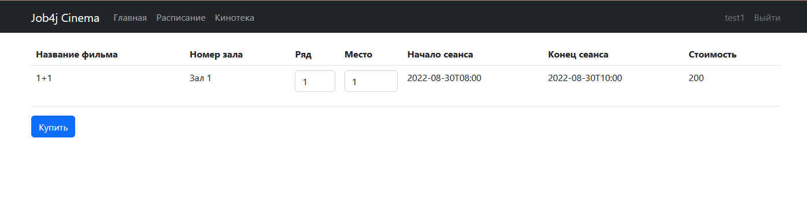

###Job4j_cinema

####Описание проекта: 
Данный проект является имитацией онлайн-сервиса для покупки билетов в кинотеатре. 
Приложение включает в себя следующий функционал: 
- регистрацию новых пользователей,
- вход уже зарегистрированных пользователей с помощью уникальных логинов и паролей, 
- вывод расписания киносеансов,
- покупку билетов.

####Стек технологий:
Для реализации проекта использовались: Java 17, Spring Boot 2, Thymeleaf, Bootstrap 5, Sql2o, PostgreSQL 14.

####Требования к окружению:
Для запуска приложения необходимы Java 17, PostgreSQL 14, Maven 3.8

####Запуск проекта:
Перед запуском приложения необходимо создать базу данных cinema в PostgreSQL 14
с помощью команды ```create database cinema```
после чего необходимо запустить скрипты из папки C:\projects\job4j_cinema\db\scripts.
Затем необходимо открыть класс C:\projects\job4j_cinema\src\main\java\ru\job4j\cinema\Main.java и запустить приложение.

####Взаимодействие с приложением:
При открытии сайта запускается главная страница:


В случае, если пользователь не зарегистрирован на сайте, ему необходимо кликнуть на раздел "Регистрация" 
и перейти на страницу регистрации:


Пользователь сайта должен ввести свое имя, адрес электронной почты и придуманный пароль в соответствующие поля ввода
и нажать на кнопку "Сохранить".

В случае, если пользователь уже зарегистрирован на сайте, ему необходимо кликнуть на раздел "Войти"
и перейти на страницу входа:


Пользователь сайта должен ввести свой адрес электронной почты и пароль в соответствующие поля ввода
и нажать на кнопку "Войти".

После входа или регистрации пользователя перенаправляет в раздел "Кинотека", в котором пользователь может 
ознакомиться с фильмами, которые идут в кинотеатре. 


Для выбора сеанса и покупки билета пользователю необходимо перейти в раздел "Расписание".
Для выбора ряда и места на понравившейся сеанс пользователю необходимо нажать на кнопку
"Купить" для перехода на страницу покупки билета:


На странице покупки билета предлагается выбрать ряд и место.
После выбора ряда и места приобрести билет можно с помощью кнопки "Купить":


В случае успешного приобретения билета, пользователя перенаправит на страницу с информационным сообщением, 
где указана вся информация о сеансе:


В случае, если билет на выбранное место уже куплен, пользователя перенаправит на страницу с ошибкой, 
ему нужно будет вернуться на страницу приобретения билета и выбрать новое место.


####Контакты
При возникновении вопросов, обращайтесь в телеграм: https://t.me/relaxedlife05